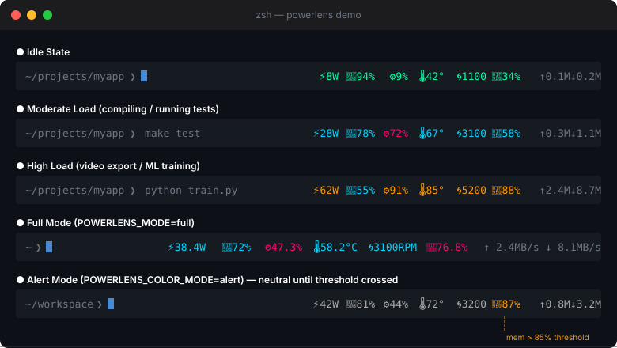
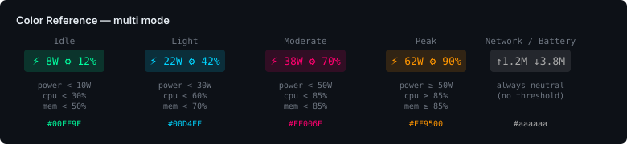

# PowerLens ⚡

> Real-time system metrics in your zsh right prompt — power, battery, CPU, CPU temp, fan speed, memory, and network I/O, glanceable at a glance.

[](LICENSE)


[](https://github.com/luyangkk/powerlens/actions/workflows/ci.yml)



PowerLens is a lightweight Oh-My-Zsh plugin that embeds live system metrics into `RPROMPT`. A single background daemon collects all data every 2 seconds; the prompt reads a cached JSON file on each `precmd` — adding less than 5ms to prompt render time regardless of how many terminal windows you have open.

---

## Features

| | |
|---|---|
| **7 metrics** | Power (W) · Battery % · CPU % · CPU temp °C · Fan speed RPM · Memory % · Network ↑↓ MB/s |
| **Two color modes** | `multi` — 4-level gradient per metric / `alert` — neutral until threshold |
| **Two display modes** | `compact` — abbreviated values / `full` — with units and decimals |
| **Per-metric toggles** | Show or hide any metric independently |
| **Singleton daemon** | N terminal windows → 1 daemon process, never more |
| **Crash recovery** | Stale data (>10s) auto-detected; daemon restarted silently |
| **SSH-aware** | Daemon skipped in remote shells; shows `--` gracefully |
| **macOS 12+** | Apple Silicon (arm64) and Intel (amd64), no sudo required |

---

## Color Reference



Each metric is colored independently. Thresholds are fully configurable.

---

## Installation

### Oh-My-Zsh

```bash
git clone https://github.com/luyangkk/powerlens.git \
  ~/.oh-my-zsh/custom/plugins/powerlens
```

Add `powerlens` to your plugins list in `~/.zshrc`:

```zsh
plugins=(... powerlens)
```

Reload your shell:

```bash
source ~/.zshrc
```

### Build from Source

If macOS blocks the pre-compiled binary (Gatekeeper), build it yourself — requires Go 1.21+:

```bash
cd ~/.oh-my-zsh/custom/plugins/powerlens
make install
```

Or remove the quarantine flag from the pre-built binary:

```bash
xattr -d com.apple.quarantine bin/powerlens-fetch-arm64   # Apple Silicon
xattr -d com.apple.quarantine bin/powerlens-fetch-amd64   # Intel
```

---

## Configuration

All options are set in `~/.zshrc` **before** the `plugins=(...)` line.

### Display

```zsh
POWERLENS_MODE=compact        # compact | full
POWERLENS_COLOR_MODE=multi    # multi   | alert
```

**`compact`** (default):
```
⚡38W 🔋87% ⚙34% 🌡55° 🌀1200 🧠62% ↑1.2M↓3.8M
```

**`full`**:
```
⚡ 38.4W 🔋 87% ⚙ 34.2% 🌡 55.0°C 🌀 1200RPM 🧠 62.1% ↑ 1.2MB/s ↓ 3.8MB/s
```

### Show / Hide Metrics

```zsh
POWERLENS_SHOW_BATTERY=true   # true | false
POWERLENS_SHOW_CPU=true
POWERLENS_SHOW_TEMP=true
POWERLENS_SHOW_FAN=true       # hidden automatically on fanless Macs
POWERLENS_SHOW_MEM=true
POWERLENS_SHOW_NET=true
```

### Network Interface

```zsh
POWERLENS_NET_IFACE=default   # default | wifi | ethernet
```

| Value | Behavior |
|-------|----------|
| `default` | Follows the default route — whichever interface the OS is routing traffic through (WiFi, Ethernet, or VPN). Icon updates automatically when the active interface changes. |
| `wifi` | Always monitors the Wi-Fi interface. Falls back to 🌐 if Wi-Fi is inactive. |
| `ethernet` | Always monitors the first wired Ethernet interface. Falls back to 🌐 if none is connected. |

The interface type is shown as an icon prefix on the network display:
- 📶 Wi-Fi
- 🔌 Ethernet
- 🌐 Other / VPN

### Refresh Interval

```zsh
POWERLENS_REFRESH=2           # seconds between daemon polls
```

### Color Thresholds — `multi` Mode

Each metric has three thresholds that divide the four color levels (Idle → Light → Moderate → Peak):

```zsh
# Power (Watts)
POWERLENS_THRESH_POWER_IDLE=10
POWERLENS_THRESH_POWER_LIGHT=30
POWERLENS_THRESH_POWER_MODERATE=50

# CPU (%)
POWERLENS_THRESH_CPU_IDLE=30
POWERLENS_THRESH_CPU_LIGHT=60
POWERLENS_THRESH_CPU_MODERATE=85

# Memory (%)
POWERLENS_THRESH_MEM_IDLE=50
POWERLENS_THRESH_MEM_LIGHT=70
POWERLENS_THRESH_MEM_MODERATE=85

# CPU Temperature (°C)
POWERLENS_THRESH_TEMP_IDLE=50
POWERLENS_THRESH_TEMP_LIGHT=70
POWERLENS_THRESH_TEMP_MODERATE=85

# Fan Speed (RPM)
POWERLENS_THRESH_FAN_IDLE=2000
POWERLENS_THRESH_FAN_LIGHT=3500
POWERLENS_THRESH_FAN_MODERATE=5000
```

Default values are tuned for Apple Silicon MacBooks. Adjust for your machine.

### Alert Thresholds — `alert` Mode

In `alert` mode all metrics render in neutral gray (`#aaaaaa`) until a single threshold is crossed, then switch to orange (`#FF9500`):

```zsh
POWERLENS_ALERT_POWER=50      # W
POWERLENS_ALERT_CPU=80        # %
POWERLENS_ALERT_MEM=85        # %
POWERLENS_ALERT_TEMP=80       # °C
POWERLENS_ALERT_FAN=4000      # RPM
```

---

## How It Works

```
┌──────────────────────────────────────────────────────┐
│  Terminal 1      Terminal 2      Terminal 3           │
│  (precmd)        (precmd)        (precmd)             │
│      │               │               │               │
│      └───────────────┴───────────────┘               │
│                      │                               │
│              read metrics.json                       │
│              (only on mtime change)                  │
│                      │                               │
│      ┌───────────────▼──────────────────────┐        │
│      │  powerlens-fetch  (singleton daemon)  │        │
│      │  · IOKit → power, battery             │        │
│      │  · IOKit/SMC → CPU temp, fan speed    │        │
│      │  · gopsutil → CPU, memory, network    │        │
│      │  · writes metrics.json every 2s       │        │
│      └──────────────────────────────────────┘        │
└──────────────────────────────────────────────────────┘
```

- The daemon is started by the first shell and shared across all subsequent shells (PID file singleton).
- Each `precmd` checks the file modification time — the JSON is re-parsed only when it actually changes.
- The last shell to exit kills the daemon.

---

## Behavior Reference

| Scenario | Display |
|----------|---------|
| Normal | Metrics with color |
| Charging | `🔋` replaced with `🔌` |
| Desktop Mac (no battery) | Battery element hidden |
| Daemon crashed | `⚡ --W 🔋 --% ⚙ --% 🧠 --% ↑ -- ↓ --` → daemon auto-restarted |
| SSH remote shell | Same degraded display, no daemon launched |
| First network sample | `↑0.0M ↓0.0M` (no previous snapshot to diff against) |
| Fanless Mac (e.g. M1/M2 Air) | Fan metric hidden automatically |

---

## Requirements

- macOS 12 (Monterey) or later
- Zsh 5.8+
- Oh-My-Zsh

---

## Building

```bash
make arm64      # Apple Silicon
make amd64      # Intel
make universal  # Universal binary (lipo)
make all        # Both arm64 + amd64
make clean      # Remove built binaries
```

---

## Open Questions / Roadmap

- [ ] Historical mini-graph using Unicode Braille (`⣀⣄⣆⣇⣗⣷⣿`) in expanded mode
- [ ] powerlevel10k geometry integration
- [ ] Multiple battery support (MagSafe + Thunderbolt)
- [ ] CI notarization via GitHub Actions

---

## Contributing

Contributions are welcome! Please read [CONTRIBUTING.md](CONTRIBUTING.md) before submitting a pull request.

---

## License

MIT — see [LICENSE](LICENSE) for details.
